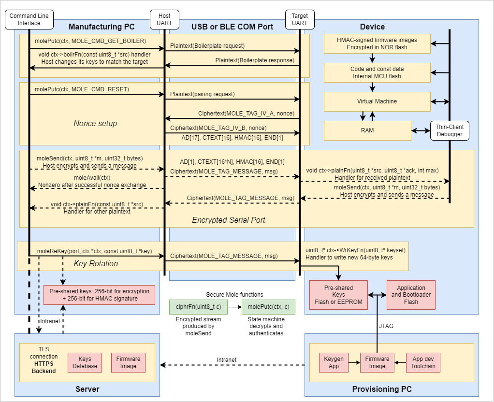

# 5.2 Software Requirements Analysis

The software is the `mole` API, generally used to secure system interfaces.

## 5.2.1 System view of software requirements

The system requirements of `mole` are:

1. Lock down UARTs or other ports using strong authenticated encryption.
2. Prevent spoofing by not using PKE.
3. Support key rotation.
4. Encrypt and decrypt files, data logs, and boot firmware.
5. Recover easily from corrupted data.

Due to the rapidly advancing threat landscape of networked devices, many safety standards mandate
strong cybersecurity protection. Even without a mandate, vulnerabilities are a business liability.
A particular need is to "lock down" UARTs on production devices to prevent snooping at the PCB level.
When the UART passes data across an enclosure boundary, strong authenticated encryption is required.
Encryption of SPI NOR Flash and file system devices such as Micro SD also prevents PCB snooping.

Self-signed TLS certificates have limited to no utility depending on the use case,
since if an institution's firewall is breached and bots are on the private network,
a MiTM (man in the middle) attack could be launched using a stolen certificate.
The MiTM then serves as a relay, passing through data while decrypting it with captured keys.
The device is spoofed. It has no way to tell that the certificate wasn't stolen (sniffed).
Such MiTM attacks apply to UARTs in the wild. Spoofing is handled by not using PKE.
Instead, the application is responsible for management of pre-arranged keys.

Keys need to be updatable to prevent key fatigue and handle key leaks.

The system creates encrypted self-contained data objects (files).
This is only possible with pre-arranged keys.
Key escrow would be used for key management.
With the help of the key escrow, an encrypted file may be decrypted and authenticated.

Diagram showing key management in the context of a system utilizing **mole**

## 5.2.2 Software requirements content

**a) functional and capability requirements**

`mole` is an encryption library designed for UARTs on small MCUs.
It is coded in C99 and does not use an operating system or have a specific platform.
`mole` does not use memory allocation or multitasking.

The software environment is an MCU containing:

- ARM Cortex, RISC-V, or similar 32-bit core.
- TRNG (True Random Number Generator)
- A UART.

**b) SOFTWARE SYSTEM inputs and outputs**

The inter-system data is a stream of plaintext commands and encrypted data.
AEAS encompasses the embedded plaintext to prevent tampering.
The stream is terminated with one or more 0x0A ('\\n') bytes.
Encrypted data does not include '\\n' (it is worked around using an escape sequence)
so bridge devices can be use '\\n' as an end-of-message marker.

All messages are encrypted and authenticated, with the exception of a public boilerplate.
The boilerplate can be requested without a key.
All other messages cannot be received without the correct 256-bit passcode.

Data streams may contain errors or dropouts.
These are detectable by monitoring API return values.
Typically, the response to a transmission error is to re-pair the devices.
The application is responsible for re-sending the lost data.
Fuzz testing shall verify that '\\n' will always reset the
stream interpreter regardless of the state it's in.

**c) interfaces between the SOFTWARE SYSTEM and other SYSTEMS**

`mole.h` is the software interface. It defines the function prototypes that form the library.

**d) software-driven alarms, warnings, and operator messages**

The `MOLE_TRACE` preprocessor macro is defined as `0`, `1`, or `2`:

0 = No trace, stdio.h and printf are not used.  
1 = Some trace, includes some flow information.
2 = All trace, includes comprehensive flow information.

Error codes returned by the API are defined in `mole.h`.
The caller of the `mole` API is responsible for handling error codes.

**e) SECURITY requirements**

All encrypted messages must be authenticated.

The keyset will include an administrator passcode that `mole` will send as an encrypted
message to elevate privilege level. A non-administrator keyset will omit the passcode.
The application is responsible for handling the resulting `admin` flag. 

The calling application should implement the audit trail by monitoring unusual traffic.
For example, `molePutc` returning many errors and failing to connect would be evidence
that it is under brute force attack. Such an attack is futile, but logging it could help
track down firewall leaks. 

Communication errors, such as dropouts and bit errors, must not result in a bad message.
The message will be dropped. The application is responsible for re-pairing and re-syncing.

Malware is not executable by `mole`, even if it could be installed in an embedded system without an OS.

**f) usability engineering requirements that are sensitive to human errors**

Key management is subject to human error. 
To cope with compromised keys, `mole` must support re-keying.
Training in proper key management is critical to protecting the keys.

Misuse of the API (by application programmers) should not leak sensitive information.
The `mole` API does not support directly sending or receiving plaintext data.
Other misuse of the API will result in lost messages, but not mangled messages.

**g) data definition and database requirements**

`mole` communicates through external late-bound functions by using function pointers
set by the application.

## 5.2.3 RISK CONTROL measures

Some common risks are:

- Sensitive information could be sent in plaintext out the UART.
- The TRNG does not generate random numbers, leading to non-random IVs which compromise the key.
- The UART connection could be noisy or bad.

These are application-level problems that are outside the scope of `mole`.
They are addressed at the application level. Specifically, the application would ensure that:

1. The function that outputs plaintext is not called directly by the application.
2. The TRNG stream is indeed random.
3. It can inject errors and recover from them.

This section does not apply to `mole` itself.

## 5.2.4 Re-EVALUATE DEVICE RISK ANALYSIS

The MANUFACTURER shall re-EVALUATE the DEVICE RISK ANALYSIS when software
requirements are established and update it as appropriate.

## 5.2.5 Update SYSTEM requirements

The MANUFACTURER shall ensure that existing requirements, including SYSTEM requirements, are
re-EVALUATED and updated as appropriate as a result of the software requirements analysis ACTIVITY.

## 5.2.6 Verify software requirements

The MANUFACTURER shall verify and document that the software requirements:

a) implement SYSTEM requirements including those relating to RISK CONTROL;  
b) do not contradict one another;  
c) are expressed in terms that avoid ambiguity;  
d) are stated in terms that permit establishment of test criteria and performance of tests to
determine whether the test criteria have been met;
e) can be uniquely identified; and  
f) are traceable to SYSTEM requirements or other source.

The criteria for verification is the makefile. If the tests pass, it is verified. 
`moletest.c` shall define ports Alice and Bob, and pass messages between the two.
The tests shall include:

- Initialize ports Alice and Bob. Pass if no error code.
- Alice gets Bob's boilerplate. Pass if received.
- Bob gets Alice's boilerplate. Pass if received.
- Pair Alice and Bob, ensuring that they paired. Pass if pairing is successful.
- Alice sends a 1-character message to Bob. Pass if received.
- Alice sends an empty message to Bob. Pass if received.
- Alice sends a variety of messages to Bob, periodically injecting bit errors. Pass if messages after corrupted ones get through.
- Bob sends a variety of messages to Alice, periodically injecting bit errors. Pass if messages after corrupted ones get through.
- Alice sents an administrator passcode to BoB. Pass if it is received successfully.
- Alice re-keys Bob, who then re-keys Alice. Pass if it re-pairs successfully.
- Write test data to a binary file. Pass if no file error.
- Read test data back from the file. Pass if it matches and authenticates.

