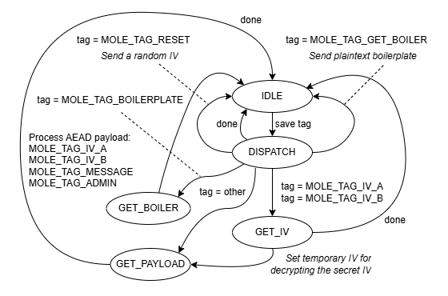

# 5.4 Software detailed design

## 5.4.1 [SOFTWARE UNIT](./glossary.md#SOFTWARE_UNIT) composition of the [SOFTWARE ARCHITECTURE](./5.3_Architecture.md)
The **mole** [SOFTWARE ITEM](./glossary.md#SOFTWARE_ITEM) consists of three [SOFTWARE UNITS](./glossary.md#SOFTWARE_UNIT):

- `mole.c`, the mole API
- `xchacha.c`, encryption/decryption primitives
- `blake2s.c`, one-way hash and HMAC primitives

## 5.4.2 Detailed design for each [SOFTWARE UNIT](./glossary.md#SOFTWARE_UNIT)

### 5.4.2.1 mole
The context data structure for **mole** is:
```C
typedef struct
{   const char* name;           // port name (for debugging)
    xChaCha_ctx *rcCtx;         // receiver encryption context
	blake2s_state *rhCtx;       // receiver HMAC context
    xChaCha_ctx *tcCtx;         // transmitter encryption context
	blake2s_state *thCtx;       // transmitter HMAC context
    mole_boilrFn boilrFn;       // boilerplate handler (from molePutc)
    mole_plainFn plainFn;       // plaintext handler (from molePutc)
    mole_ciphrFn ciphrFn;       // ciphertext transmit function
    mole_WrKeyFn WrKeyFn;       // rewrite key set for this port
    hmac_initFn hInitFn;        // HMAC initialization function
    hmac_putcFn hputcFn;        // HMAC putc function
    hmac_finalFn hFinalFn;      // HMAC finalization function
    crypt_initFn cInitFn;       // Encryption initialization function
    crypt_blockFn cBlockFn;     // Encryption block function
    uint64_t hashCounterRX;     // HMAC counters, bump after each message
    uint64_t hashCounterTX; 
    uint8_t cryptokey[32];      // encryption key
    uint8_t hmackey[16];        // HMAC key
    uint8_t adminpasscode[16];  // Administrator passcode
    const uint8_t *boilerplate; // port boilerplate
    uint8_t *rxbuf;             // allocated receive buffer
    uint8_t txbuf[16];          // working buffer for encryption
    enum moleStates state;      // of the FSM
    uint8_t hmac[16];           // incoming HMAC signature
    uint32_t counter;           // TX counter
    uint32_t chunks;            // for stream decryption
    uint16_t rBlocks;           // size of rxbuf in blocks
    uint16_t avail;             // max size (in blocks) of message you can send
    uint16_t ridx;              // rxbuf index
    uint8_t MACed;              // HMAC triggered
    uint8_t tag;                // received message type
    uint8_t escaped;            // assembling a 2-byte escape sequence
    uint8_t txidx;              // byte index for char output
    uint8_t prevblock;          // previous message block (for file out)
    uint8_t rReady;             // receiver is initialized
    uint8_t tReady;             // transmitter is initialized
    uint8_t adminOK;            // adminOK password was received
} port_ctx;
```
**port_ctx** uses these function prototypes set up by the client:
```C
typedef void (*mole_ciphrFn)(uint8_t c);    // 
typedef void (*mole_plainFn)(const uint8_t *src, int length);
typedef void (*mole_boilrFn)(const uint8_t *src);
typedef uint8_t* (*mole_WrKeyFn)(uint8_t* keyset);
```
**mole_ciphrFn** transmits a byte of raw ciphertext.

**mole_plainFn** is a handler for received plaintext messages.

**mole_boilrFn** is a handler for received boilerplate.
The boilerplate is a counted zstring: A length byte followed by a zero-terminated string.

**mole_WrKeyFn** writes a new keyset.
The return value is the address of the newly written keyset.

**port_ctx** uses these function prototypes internally:
```C
typedef int  (*hmac_initFn)(size_t *ctx, const uint8_t *key, int hsize, uint64_t ctr);
typedef void (*hmac_putcFn)(size_t *ctx, uint8_t c);
typedef int  (*hmac_finalFn)(size_t *ctx, uint8_t *out);
typedef void (*crypt_initFn)(size_t *ctx, const uint8_t *key, const uint8_t *iv);
typedef void (*crypt_blockFn)(size_t *ctx, const uint8_t *in, uint8_t *out, int mode);
```
See sections 5.4.2.17 and 5.4.2.18 for documentation on how these are used.

Sections 5.4.2.2 to 5.4.2.16 provide details for [architecture](./5.3_Architecture.md)
sections 5.3.2.1 to 5.3.2.15.

### 5.4.2.2 void moleNoPorts
Return value: None

Parameter list: None

Clears the port list, which is a static one-time stack. Call before **moleAddPort**.
May be used to wipe contexts before exiting an app so sensitive data doesn't hang around in memory.

The size of the static buffer is `MOLE_ALLOC_MEM_UINT32S`,
generously defined as 4096 if the software environment does not define it first.
`static void * Allocate(int bytes)` allocates memory from this buffer, returning -1 if "out of memory".

### 5.4.2.3 int moleAddPort
Return value: 0 if okay, else error code.

Parameter list:

| Typedef         | Name        | Usage                                     |
| --------------- | ----------- | ----------------------------------------- |
| port_ctx\*      | ctx         | Port identifier                           |
| const uint8_t\* | boilerplate | Plaintext port identification boilerplate |
| int             | protocol    | AEAD protocol used: 0 = xchacha20-blake2s |
| const char\*    | name        | Name of port (for debugging)              |
| uint16_t        | rxBlocks    | Size of receive buffer in 64-byte blocks  |
| mole_boilrFn    | boiler      | Handler for received boilerplate (src, n) |
| mole_plainFn    | plain       | Handler for received data (src, n)        |
| mole_ciphrFn    | ciphr       | Handler for char transmission (c)         |
| mole_WrKeyFn    | WrKeyFn     | Function to overwrite the key             |

Used to configure one or more **mole** ports.
The typedefs of the functions are:

```C
typedef void (*mole_boilrFn)(const uint8_t *src);  // handle received boilerplate
typedef void (*mole_plainFn)(const uint8_t *src, int length); // handle message
typedef void (*mole_ciphrFn)(uint8_t c);           // output raw ciphertext byte
typedef uint8_t* (*mole_WrKeyFn)(uint8_t* keyset); // write new keyset
```
**moleAddPort** initializes `port_ctx` from the parameter list and allocates
context memory based on **protocol**.
It must test the memory allocation after each Allocate to verify that memory did not run out.

### 5.4.2.4 int moleNewKeys
Return value: 0 if okay, else error code; usually MOLE_ERROR_BAD_HMAC

Parameter list:

| Typedef         | Name   | Usage                                                           |
| --------------- | ------ | --------------------------------------------------------------- |
| port_ctx\*      | ctx    | Port identifier                                                 |
| const uint8_t\* | keyset | 32-byte user passcode, 16-byte admin passcode, and 16-byte HMAC |

Loads new keys into the port.

1. Verify that the keyset has a good HMAC using `KDFhashKey` as a key.
`KDFhashKey` is a system-defined value chosen by the manufacturer.
The purpose of the HMAC is not authentication, but error detection.
2. Derive the HMAC key from the user passcode based on a KDF.
3. Derive the encryption key from the user passcode based on a KDF.
3. Derive the admin passcode from the admin passcode based on a KDF.
This reduces the attack surface by obfuscating the passcode while it sits in memory.

### 5.4.2.5 int molePutc
Return value: 0 if okay, else error code.

Parameter list:

| Typedef    | Name | Usage            |
| ---------- | ---- | ---------------- |
| port_ctx\* | ctx  | Port identifier  |
| uint8_t    | c    | Incoming byte    |

Input raw ciphertext (or command), such as received, from a UART or other input stream.

**molePutc** is a FSM (Finite State Machine) that invokes various functions set by **moleAddPort**.
Incoming bytes are fed into `molePutc` one at a time and processed per the current state.
The stages of `molePutc` are sequential:

1. Check for escape sequences, which filter raw 0x0A bytes from binary data and capture the HMAC.
2. Append the binary byte to the hash whether it's hashed or not.
3. Process the byte per the current state of the state machine.
4. When a message has been received, call its output function.
5. Exit `molePutc`.

The FSM of step 3 uses the following states:


### 5.4.2.6 int moleTxInit
Return value: 0 if okay, else error code.

Parameter list:

| Typedef    | Name | Usage            |
| ---------- | ---- | ---------------- |
| port_ctx\* | ctx  | Port identifier  |

Send an IV to enable moleSend, needed if not paired.
This would be used to establich an IV for encrypted output without the need for pairing.

### 5.4.2.7 int moleSend
Return value: 0 if okay, else error code.

Parameter list:

| Typedef         | Name  | Usage                       |
| --------------- | ----- | --------------------------- |
| port_ctx\*      | ctx   | Port identifier             |
| const uint8_t\* | m     | Plaintext message to send   |
| int             | bytes | Length of message in bytes  |

Encrypt and send a message out the **ciphr** function.

### 5.4.2.8 int moleReKey
Return value: 0 if okay, else error code.

Parameter list:

| Typedef         | Name  | Usage                       |
| --------------- | ----- | --------------------------- |
| port_ctx\*      | ctx   | Port identifier             |
| const uint8_t\* | key   | Passcode to transfer        |

Encrypt and send a re-key message, returns key.
The flow sequence is:

- Alice encrypts and sends a "re-key" message to Bob
- If Bob accepts the key, Bob sends a re-key message to Alice

If Alice does not receive a re-key message, something went wrong:

1. Bob did not accept the new key and is still using the old key.
2. Bob was re-keyed, but Alice did not get the message.

In case 1, Alice keeps using the old key, re-pair, and tries again.

In case 2, Alice tries to the new key and keeps it if it works.

Such application-level error handling is outside the domain of **mole**.

### 5.4.2.9 int moleAvail
Return value: Capacity of the far end's receive buffer.

Parameter list:

| Typedef    | Name | Usage            |
| ---------- | ---- | ---------------- |
| port_ctx\* | ctx  | Port identifier  |

Get number of bytes allowed in a message

### 5.4.2.10 int molePair
Return value: None

Parameter list:

| Typedef    | Name | Usage            |
| ---------- | ---- | ---------------- |
| port_ctx\* | ctx  | Port identifier  |

Send a pairing request. The far end will send a random IV, which is met with
a random IV response.

### 5.4.2.11 int moleBoilerReq
Return value: None

Parameter list:

| Typedef    | Name | Usage            |
| ---------- | ---- | ---------------- |
| port_ctx\* | ctx  | Port identifier  |

Send a boilerplate request

### 5.4.2.12 int moleAdmin
Return value: None

Parameter list:

| Typedef    | Name | Usage            |
| ---------- | ---- | ---------------- |
| port_ctx\* | ctx  | Port identifier  |

Send the administrative passcode in the keyset.
A keyset may contain or omit the passcode depending on access requirements.

---------------------------------------------------------------------------
### File encryption

File encryption is done in 16-byte blocks using the following functions:

- int  moleFileNew (port_ctx \*ctx);
- void moleFileOut (port_ctx \*ctx, const uint8_t \*src, int len);
- void moleFileFinal (port_ctx \*ctx);

The output stream is like a train. The boilerplate and IV initialization are the locomotive,
the chunks are rail cars, and the HMAC of the entire data is the caboose.
This chain of chunks, where the IV is counter-based, localizes damage from data corruption.
One bad bit will wipe out the HMAC of a rail car, not the whole train.
The final HMAC will fail, but most of the data in the file will not be lost or un-authenticated.
Also, an isolated chain is useless. It must be connected to the locomotive.

### 5.4.2.13 int moleFileNew
Return value: 0 if okay, else error code.

Parameter list:

| Typedef         | Name  | Usage                       |
| --------------- | ----- | --------------------------- |
| port_ctx\*      | ctx   | Port identifier             |

Output boilerplate and IV preamble

### 5.4.2.14 void moleFileOut
Return value: None

Parameter list:

| Typedef         | Name  | Usage                       |
| --------------- | ----- | --------------------------- |
| port_ctx\*      | ctx   | Port identifier             |
| const uint8_t\* | src   | Plaintext to encrypt        |
| int             | len   | Length in bytes             |

Encrypt and output a message. The message length must be a multiple of 16.
If the chunk being created surpasses a length set by MOLE_FILE_CHUNK_SIZE_LOG2,
that chunk is terminated with a HMAC and a new chunk is started.

The reason for breaking the file into chunks is for error tolerance.
Chunks are an exact power of 2 bytes in length, including padding.
When counting or seeking chunks, they start at predictable file positions.
A bad chunk does not irretrievably corrupt the file structure.

### 5.4.2.15 void moleFileFinal
Return value: None

Parameter list:

| Typedef         | Name  | Usage                       |
| --------------- | ----- | --------------------------- |
| port_ctx\*      | ctx   | Port identifier             |

Finish the file output by sending the HMAC of the last chunk and the HMAC of the overall set of chunks.
---------------------------------------------------------------------------

### 5.4.2.16 int moleFileIn
Return value: 0 if okay, else error code.

Parameter list:

| Typedef         | Name  | Usage                         |
| --------------- | ----- | ----------------------------- |
| port_ctx\*      | ctx   | Port identifier               |
| mole_inFn       | cFn   | Input function                | 
| mole_outFn      | mFn   | Output function, NULL if none |

Decrypts a file created by moleFileNew, moleFileOut, and moleFileFinal.
The function typedefs are:

```C
typedef int (*mole_inFn)(void); // returns 0 to 255, -1 if end-of-stream
typedef void (*mole_outFn)(uint8_t c);
```


### 5.4.2.17 xchacha

The context data structure for **xchacha** is:
```C
typedef struct
{   uint32_t input[16];     // state
    uint8_t chabuf[64];     // keystream buffer
    uint8_t chaptr;         // keystream pointer
    uint8_t blox;           // block counter
} xChaCha_ctx;
```
The function `void xchacha_init(xChaCha_ctx *ctx, const uint8_t *k, uint8_t *iv)`
initializes a 64-byte keystream stored in **chabuf**.
Key **k** and IV **iv** set the initial **input**.

The function `void xc_crypt_block(xChaCha_ctx *ctx, const uint8_t *in, uint8_t *out, int mode)`
xors the next 16 bytes of the keystream with **in** to produce **out**.
When the keystream is exhausted, which happens every 4 blocks,
the private `xchacha_next` function fills chabufwith a new 64-byte block of keystream.

The above two functions provide the API for Blake2s. A sample usage would be:
```C
xChaCha_ctx MyCrypt;
...
xchacha_init(&MyCrypt, MyKey, MyIV);
xc_crypt_block(&MyCrypt, Plaintext16data, OutputData);
```
### 5.4.2.18 blake2s

The context data structure for **blake2s** is:
```C
  typedef struct
  {
    uint32_t h[8];
    uint32_t t[2];
    uint32_t f[2];
    uint8_t  buf[64];
    int   buflen;
    int   outlen;
    uint8_t  last_node;
  } blake2s_state;
```
The function `void b2s_hmac_putc(blake2s_state *S, uint8_t c)` stores **c** in **buf**
using **buflen** as an index.
When **buf** is full, **b2s_hmac_putc** invokes the Blake2s algorithm:
```C
    blake2s_increment_counter(S, 64);
    blake2s_compress( S, S->buf );
```

The function `b2s_hmac_init(blake2s_state *S, const uint8_t *key, int hsize, uint64_t ctr)`
initializes the hash function and places an initial 64-byte hash, based on **key** and **ctr**,
in `S->buf`. **hsize** may be any value up to 64.

The function `b2s_hmac_final(blake2s_state *S, uint8_t *out)` finalizes the hash and sends
**hsize** bytes of it to **out**.
It does this by zeroing out `S->buf` after `S->buflen` and calling `blake2s_compress`.

The above three functions provide the API for Blake2s. A sample usage would be:
```C
blake2s_state MyHash;
...
b2s_hmac_init(&MyHash, MyKey, 32, 0);
b2s_hmac_putc(&MyHash, 'H');
b2s_hmac_putc(&MyHash, 'i');
b2s_hmac_final(&MyHash, OutputBuffer);
```
-------------------------
## 5.4.3 Develop detailed design for interfaces

`mole.c` includes `xchacha.c` and `blake2s.c`, both of which are independent units.
`xchacha.c` and `blake2s.c` do not call outside of themselves or issue callbacks.
Their interfaces are encapsulated by `mole.c`.

`moletest.c` includes `mole.c`.

### 5.4.3.1 mole API
The interface to **mole** is documented in the [Architecture](./5.3_Architecture.md) document.

### 5.4.3.2 moletest API
`moletest.c` is a console app that performs unit tests on **mole**.
Its `main` function returns 0 if all tests passed, or an error code otherwise.
The error codes are:

0x1004 Pairing failure, ports could not exchange IVs.
0x1008 Message did not get through.
0x1040 Admin passcode was not accepted
0x1080 Re-keying failure
0x1101 Error creating new file
0x1102 Error encrypting file
0x1200 Error decrypting file

### 5.4.3.3 xchacha API
This version of [xchacha](https://github.com/bradleyeckert/xchacha) uses a streaming API
designed to interface to **mole**. This API consists of:
```C
/** Encryption/decryption initialization
 * @param ctx   Encryption/Decryption context
 * @param key   Key, 32 bytes
 * @param iv    Initialization vector, 16 bytes
 */
void xc_crypt_init(xChaCha_ctx *ctx, const uint8_t *key, const uint8_t *iv);

/** 16-byte block encryption/decryption
 * @param ctx   Encryption/Decryption context
 * @param in    16-byte buffer holding the input data
 * @param out   16-byte buffer holding the output data
 * @param mode  ignored
 */
void xc_crypt_block(xChaCha_ctx *ctx, const uint8_t *in, uint8_t *out, int mode);
```
The `ctx` context points to a structure, defined in 5.4.2.3.

### 5.4.3.4 blake2s API
This version of [Blake2s](https://github.com/bradleyeckert/blake2s) is from a Github repository.
Tha main feature is its streaming API designed to interface to **mole**.
This API consists of:

```C
/** HMAC initialization
 * @param ctx   HMAC context
 * @param key   Key, 32 bytes
 * @param hsize Expected hash length in bytes
 * @param ctr   64-bit counter to prevent replay attacks, may be initially 0
 * @return      Actual hash length in bytes (0 if bogus)
 */
int b2s_hmac_init(blake2s_state *S, const uint8_t *key, int hsize, uint64_t ctr);

/** HMAC append byte
 * @param ctx   HMAC context
 * @param c     Byte to add to HMAC
 */
void b2s_hmac_putc(blake2s_state *S, uint8_t c);

/** HMAC append byte
 * @param ctx   HMAC context
 * @param out   Output hash
 * @return      Hash length in bytes
 */
int b2s_hmac_final(blake2s_state *S, uint8_t *out);
```
The `ctx` context points to a structure, defined in 5.4.2.4.

## 5.4.4 Verify detailed design

A traceability matrix verifies that the detailed design implements the architecture:

| Architecture               | Detailed design |
| -------------------------- | --------------- |
| 5.3.2.1 void moleNoPorts   | 5.4.2.2         |
| 5.3.2.2 int moleAddPort    | 5.4.2.3         |
| 5.3.2.3 int moleNewKeys    | 5.4.2.4         |
| 5.3.2.4 int molePutc       | 5.4.2.5         |
| 5.3.2.5 int moleTxInit     | 5.4.2.6         |
| 5.3.2.6 int moleSend       | 5.4.2.7         |
| 5.3.2.7 int moleReKey      | 5.4.2.8         |
| 5.3.2.8 int moleAvail      | 5.4.2.9         |
| 5.3.2.9 int molePair       | 5.4.2.10        |
| 5.3.2.10 int moleBoilerReq | 5.4.2.11        |
| 5.3.2.11 int moleAdmin     | 5.4.2.12        |
| 5.3.2.12 int moleFileNew   | 5.4.2.13        |
| 5.3.2.13 void moleFileOut  | 5.4.2.14        |
| 5.3.2.14 void moleFileFinal| 5.4.2.15        |
| 5.3.2.15 int moleFileIn    | 5.4.2.16        |
