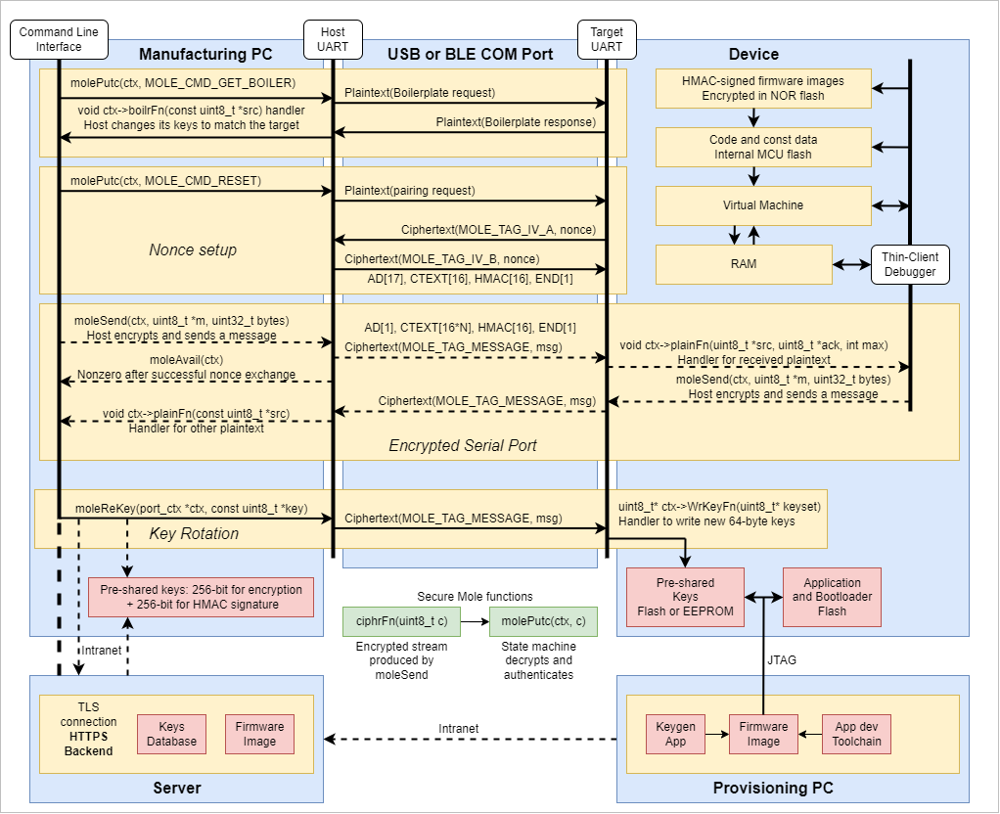

# Mole - Cryptographic protection for serial ports

Cybersecurity for embedded systems is now a thing.
In many markets, encryption is mandated for data crossing enclosure boundaries.
`mole` encrypts UART traffic using a relatively small memory footprint.
While it uses xchacha20-blake2s for AEAD by default,
other encryption and HMAC schemes are easily added (AES-SHA, SH4-SH3, etc).

`mole` achieves its small footprint by not trying to copy the SSL/TLS usage model that was made for the Internet.
The usage model is closer to that of NFT cards like Mifare DESFire: many cards, few readers.
A Mifare card reader is expected to have network connectivity so it can get the
required key from a server if it doesn't already have it.
Likewise, one of the devices using Mole is assumed to have an Internet connection
for getting the required keys from a remote server or key vault.
In other words, `mole` uses a closed ecosystem.

Manufacturers already operate a closed ecosystem for their products.
`mole` is meant more for manufacturers who need a UART to securely access their systems remotely or in the field.
A secure channel facilitates update pushing, which is another emerging cybersecurity requirement.
Pre-shared keys avoid PKE. Without PKE, there is no spoofing.

The tradeoff between pre-shared vs public keys is influenced by advanced Man-in-The-Middle
(MiTM) spoofing [tools](https://slava-moskvin.medium.com/extracting-firmware-every-method-explained-e94aa094d0dd)
that create self-signed HTTPS certificates.
There are also tools to defeat SSL pinning. The problems with key escrow,
mostly centered on trust, would not be solved with PKE and certificates.
A manufacturer can brick your device either way.
One-way encrypted messages, such as those stored in files, do not support key exchange,
which rules out PKE. Booting from encrypted Flash would not use PKE.

With pre-shared keys, an authorized user must securely log into the key server and
download the key in order to pair a UART connection.
Key management relies on key escrow instead. Anti-spoofing relies on the security of the escrow.

A block diagram of the Mole serial port encryption in the context of a key management system:

## AEAD

[Wikipedia](https://en.wikipedia.org/wiki/Authenticated_encryption):
> Authenticated encryption with associated data (AEAD) is a variant of AE that allows the message to include "associated data" (AD, additional non-confidential information, a.k.a. "additional authenticated data", AAD).
A recipient can check the integrity of both the associated data and the confidential information in a message.

`mole` uses a symmetric algorithm for encryption and a HMAC (hash) algorithm for message signing.

The default protocol used by `mole` is **XChaCha20-Blake2s**. [Blake2s](https://datatracker.ietf.org/doc/html/rfc7693.html) is used as a HMAC.
Its 16-byte output authenticates the entire message, including the plaintext header,
so that the header cannot be altered.
The hash includes a 64-bit counter that gets incremented after each message,
which rules out replay attacks.

Cryptographic functions are called through function pointers held in the port's `struct`.
Other AEAD algorithms may be plugged in by using the default setup as a template.
Private keys are derived from a KDF whose 64-byte input is:

- 256-bit Login passcode, must match on both ends to send messages.
- 128-bit Admin passcode, must match on both ends to raise the privilege level.
- 128-bit HMAC hash, for error-checking the passcodes.

## Escape sequences

`mole` uses escape sequences to reserve characters for framing messages in UART streams.
The most common ending on terminal input is a newline, `\n`, or 0x0A.
The binary stream has its `\n` translated to `0x0B 0x00` when sent across a wire,
reserving `\n` for the actual end-of-message.

`mole` messages begin with a character less than blank (<0x20) and end with `\n` (0x0A).
Cooked terminal input can be directed elsewhere because it begins with (>0x1F).
The underlying UART interface can buffer input until `\n` before sending it on.

## Language dependencies

- C99
- Little-endian byte order
- Hardware-specific functions in `*HW.c` file(s)

Most of the byte-order dependency comes from using `memcpy` to move data to and from byte arrays.
It could be replaced with a `MEMCPY` macro that substitutes a byte-reversing
version of `memcpy` for big-endian targets.

## Hardware requirements

- True random number generator
- 32-bit CPU such as ARM or RISC-V
- On-chip Flash memory for code and keys
- UART

The true random number generator is used to generate unique 128-bit IVs to avoid IV reuse.
Each session starts with a random IV and lasts as long as the port is in use without any errors or resets.

If an IV were to be reused, and the ciphertext has been logged (by sniffing UART traffic),
the two sessions could be XORed to leak data that may be useful.
The probably of it happening would be 2-64 due to the Birthday Problem if the numbers are actually random.
264 sessions, at 1 session per hour, would be 600 billion years.

## Pairing

Key management is outside the scope of `mole`.
Pairing assumes that both ends of the communication channel have the same private keys.
They are pre-shared. A pairing handshake between Alice and Bob proceeds as follows:

- Bob sends a pairing request to Alice
- Alice sends a random 128-bit IV to Bob
- Bob sends a random 128-bit IV to Alice

The IV is sent encrypted using a one-time-use random IV, which is in plaintext.
Each communication session starts with a different IV so that the keystream never repeats.
The hash key is changed after each message as extra protection against replay attacks.

After the pairing handshake is finished,
`moleAvail(&Alice)` returns 0 if synchronization has been lost due to data corruption.
The connection will have to be re-paired with `molePair(&Alice)`.

Pairing initializes the keystream. Messages use 16-byte chunks of that keystream.
As long as a different IV is used for each pairing sequence, the keystream does not repeat.

## Key management

The only plaintext sent over the port, besides message tags, is boilerplate information
that should be used to supply a UUID.
A key vault would use the UUID to look up the key.
`moleBoiler(&Alice)` triggers a boilerplate response from Bob.
The response is sent to a handler function that will use it to look up the keys.

A host PC connected to a target MCU through a UART would keep track of keys for different targets.
Depending on security requirements, the host PC can keep those keys on the cloud or in a file in encrypted format.

`mole` supports key rotation through `uint8_t* ctx->mole_WrKeyFn(uint8_t* keyset)`.
This specialized function is platform-specific since it writes to Flash.
Specifics are outside the scope of `mole`,
but keys are expected to be signed with a 16-byte HMAC.
The key set is 64 bytes total:
32 bytes for the encryption key, 16 bytes for the HMAC key, and 16 bytes for the key-set HMAC.
The key-set is signed by the HMAC key and a master key `HERMES_KEY_HASH_KEY`.
Such HMAC checking is not necessary. If an attacker could program a new key,
it would only brick the port.

The `int moleReKey(port_ctx *ctx, const uint8_t *key)` function sends a message with
new 64-byte passcode, encrypted with the existing passcode.
Its HMAC is checked before the key set is programmed.

The programming function could program multiple copies of the key set in case one is corrupted.
If `moleAddPort` reports a bad key, there is at least a backup.

## Boilerplate messages

Boilerplate messages are plaintext, so they do not get a hash.
The allowed length of a boilerplate is up to the minimum receive buffer size.
Boilerplate responses longer than that are truncated,
so the receiver will wait for an end-of-message token.

The boilerplate contains a UUID and the AEAD protocol used (0 means XChaCha20-Blake2s).
The default data structure for `mole` is:

- Length of the boilerplate in bytes, should be less than 65. Default is 18.
- 4-byte "noyb" string (noyb = None of your business) or "boot".
- 1-byte AEAD format identifier
- 13-byte UUID
- Optional CRC

The AEAD format identifier packs bitfields as follows:

- b3:b0 = AEAD protocol. 0 = XChaCha20-Blake2s.
- b7:b4 = reserved, default is 3.

A received boilerplate is sent to a handler function with src and length parameters.
It is a counted string that is zero-terminated so there are multiple ways to get the length.
The length should match the count.

## File streaming

The same scheme used for messaging can be used for encrypting files.
The port writes to the file with the transmit channel and reads from it with the receive channel.

A file should consist of:

- A boilerplate
- A challenge to set a random IV
- Authenticated message(s)
- The HMAC signature of all message data

File-like streaming is used for writing. Creating the file writes the boilerplate and challenge.
Writing to the file appends a block at a time to the output.
Every `1<<MOLE_FILE_CHUNK_SIZE_LOG2` bytes,
the message HMAC is written and a new message is begun.
The sequence of messages is serialized.
Each message aligns with a `1<<MOLE_FILE_CHUNK_SIZE_LOG2` block of storage.
For example, using `10` for `MOLE_FILE_CHUNK_SIZE_LOG2` pads each chunk to 1K bytes.
Message overhead is about 28 bytes,
so a 1K-byte chunk would use 97.3% of the block for payload data.

Closing the file saves any remaining data in the block and writes the HMAC.
Mole does not impose a length limit on the file, but it does require each message length
to be a multiple of 16 bytes.
The way to meet this requirement is to write to the file 16 or 32 bytes at a time.

For example, a 24-bit stereo CODEC produces 6-byte samples.
Five samples pack into 32 bytes, with 2 unused bytes (maybe used as telemetry).
Any data not a multiple of 16 bytes long is padded with zeros.

File reading uses `moleFileIn(&port, cFn, mFn)` where `cFn` gets the next encrypted byte
from the input stream and `mFn` outputs each plaintext byte.
It converts an input stream to an output stream.
When the input is exhausted, `moleFileIn` returns 0 for success.

The stream is like a train. The boilerplate and IV initialization are the locomotive,
the chunks are rail cars, and the HMAC of the entire data is the caboose.
This chain of chunks, where the IV is counter-based, localizes damage from data corruption.
One bad bit will wipe out the HMAC of a rail car, not the whole train.
The final HMAC will fail, but most of the data in the file will not be lost or un-authenticated.

There is no limit to the stream length. To authenticate the signature before using the data,
use NULL for `cFn`. 
The hash function, such as Blake2s, is called twice for each byte (chunk hash and global hash).
Overhead per byte is 1/32 the Blake2s block processing time plus 1/64 the XChaCha20 block processing time.
Reading an encrypted boot image from SPI Flash would occur in parallel with decryption and authentication.
The output stream of the Flash would be processed as it comes in.
Dual-mode SPI read at 40 MHz would deliver 10 MB/s, which probably makes `moleFileIn` the pacing item.
Assuming `moleFileIn` can process 1 MB/s, bootup of a 100 KB application would take 100 ms.

## Implementation

Streams are byte-wise processed, with incoming bytes fed into a FSM one at a time
and outgoing bytes fed to an output function. The basic flow is:

- Incoming ciphertext --> `int molePutc(port_ctx *ctx, uint8_t c);`
- `void (*mole_plainFn)(const uint8_t *src, uint16_t length);` --> Plaintext to app
- Plaintext from app --> `int moleSend(port_ctx *ctx, const uint8_t *m, uint32_t bytes);`
- `void (*mole_ciphrFn)(uint8_t c);` --> Outgoing ciphertext

Underlying functions (those with various dependencies) are late-bound in the port_ctx struct
to simplify reuse. There is no heap usage.
Instead, `mole` implements its own memory allocation.
It turns out that each port needs about 1KB for context and buffers.

`void (*mole_plainFn)(const uint8_t *src, uint16_t length);` is the workhorse of `mole`.
It accepts a plaintext message.
Any transmission errors will cause a "bad HMAC" failure,
which is handled by dropping the packet and resetting the connection by exchanging new nonces.

## Legal considerations

Cybersecurity is meant to protect devices and data from tampering,
not give IoT manufacturers God-like powers. Unfortunately, the two overlap.
Any application that uses Mole should make private data inaccessible to the manufacturer.
There are laws that address this:

- The GDPR, applicable in Europe
- The "Internet of Things Cybersecurity Improvement Act of 2020" in the US
- The Cybersecurity Law of the People's Republic of China
- Internet of Things (IoT) Security and Safety Framework in Japan
- The Personal Information Protection and Electronic Documents Act (PIPEDA) in Canada

### The key-escrow problem

The use of pre-shared keys puts the onus of key secrecy on the manufacturer.
Whoever is trusted with the "family jewels" must not allow copies of them to get out
into the wild. Otherwise, the affected devices would need re-keying.

Pre-shared keys are generated at provisioning,
which is the same time the device's MCU is loaded with firmware.
A utility generates random keys and merges them into the firmware image just before JTAG programming.
It also saves them to a database.
Such activity must be done in a secure location that protects the keys.

